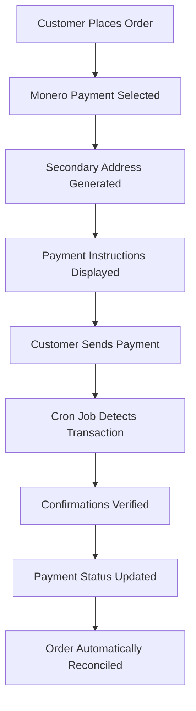

# MoneroOdoo 🏪💰

[](https://travis-ci.com/t-900-a/moneroodoo)
[](https://codecov.io/gh/t-900-a/moneroodoo)
[](https://www.odoo.com/)
[](LICENSE)

> **Accept Monero payments seamlessly in your Odoo eCommerce store with automated verification and modern architecture**

<div align="center">
  
</div>

## ✨ Key Features

- **🔄 Fully Compatible** with Odoo 18
- **🔐 Secure RPC Communication** using Python Monero library
- **⚡ Automated Payment Verification** through scheduled jobs
- **🏠 Multiple Wallet Support** with secondary address system
- **📊 Real-time Transaction Monitoring** and status updates
- **🎯 Seamless Integration** with Odoo's native payment flow

## 🚀 What's New in Version 18

### Modern Architecture Improvements
- **Payment Provider Model**: Migrated from deprecated `payment.acquirer` to modern `payment.provider` model
- **Secondary Address System**: Replaced legacy `payment_ids` with secure secondary Monero addresses
- **Unified Module**: Merged `monero-rpc-odoo` and `monero-rpc-odoo-pos` into single `payment_monero_rpc` module
- **Enhanced Security**: Improved transaction isolation and payment matching reliability

## 📦 Available Modules

| Module | Version | Description |
|--------|---------|-------------|
| **payment_monero_rpc** | `18.0.0.0.1` | Complete Monero payment integration with RPC communication |

## 🔧 How It Works

### Automated Payment Workflow



The system implements intelligent cron jobs that:
- 🔍 **Monitor** incoming transactions continuously
- ✅ **Verify** required confirmations automatically
- 🔄 **Update** payment statuses in real-time
- 📋 **Reconcile** completed payments with orders

## 📋 Prerequisites

- **Odoo 18.0** or later
- **Monero Wallet RPC** instance with network access
- **Python Monero Library** dependencies
- Proper **firewall configuration** for RPC communication

## 🛠️ Installation

### 1. Download the Module
```bash
git clone https://github.com/t-900-a/moneroodoo.git
cd moneroodoo
```

### 2. Install in Odoo
- Copy the module to your Odoo addons directory
- Update your addon list
- Install the **payment_monero_rpc** module

### 3. Configure Payment Provider
Navigate to: **Invoicing > Configuration > Payment Providers**

## ⚙️ Configuration Guide

### Basic Setup
1. **Enable** the Monero payment provider
2. **Configure** RPC connection details:
   - Wallet RPC host and port
   - Authentication credentials
   - Network settings
3. **Set** confirmation thresholds
4. **Configure** verification intervals
5. **Test** connection to ensure proper communication

### Advanced Configuration
- **Multiple Wallets**: Configure different wallets for different purposes
- **Confirmation Settings**: Adjust security vs speed preferences  
- **Monitoring Intervals**: Optimize for your transaction volume
- **Backup Strategies**: Implement wallet backup procedures

## 🔄 Upgrading from Previous Versions

> ⚠️ **Important**: Due to significant architectural changes, a clean installation is recommended for versions prior to Odoo 18.

### Migration Steps
1. **Backup** your current installation and data
2. **Test** migration scripts in staging environment
3. **Verify** all configurations post-migration
4. **Update** any custom integrations

Data migration scripts are included but require thorough testing before production use.

## 🧪 Testing

```bash
# From your Odoo installation directory
./odoo-bin -c /path/to/your/odoo.conf -d test_database -i payment_monero_rpc --test-enable --stop-after-init --log-level=test

# Or run specific test tags
./odoo-bin -c /path/to/your/odoo.conf -d test_database --test-tags payment_monero_rpc --stop-after-init
```

## 🤝 Contributing

We welcome contributions! Please see our [Contributing Guide](CONTRIBUTING.md) for details.

1. **Fork** the repository
2. **Create** your feature branch
3. **Add** tests for new functionality
4. **Submit** a pull request

## 📄 License

This project is licensed under the LGPL-3.0 License - see the [LICENSE](LICENSE) file for details.

## 💬 Support & Community

- **Issues**: [GitHub Issues](https://github.com/t-900-a/moneroodoo/issues)
- **Discussions**: [GitHub Discussions](https://github.com/t-900-a/moneroodoo/discussions)
- **Documentation**: [Wiki](https://github.com/t-900-a/moneroodoo/wiki)

## 🌟 Show Your Support

If this project helps you, please consider giving it a ⭐ on GitHub!

---

<div align="center">
  <sub>Built with ❤️ for the Monero and Odoo communities</sub>
</div>
