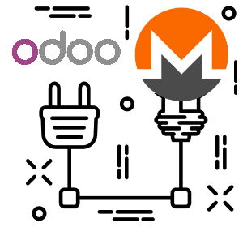

# moneroodoo

**Accept Monero (XMR) payments in your Odoo 19 eCommerce shop**

---

## Overview

`monero_rpc_odoo` is an Odoo addon that integrates [Monero (XMR)](https://www.getmonero.org) as a payment method in the Odoo eCommerce checkout. Payments are detected via a self-hosted `monero-wallet-rpc` instance — no third-party payment processor, no KYC, no tracking.

## Features

-  **Privacy-first** — payments processed via your own Monero wallet RPC
-  **Live XMR/USD rate** — fetched from CoinGecko every 15 minutes
-  **Automatic currency conversion** — list products in USD, buyers pay in XMR
-  **QR code** — generated at checkout for easy mobile payments
-  **0-conf or confirmed** — configurable security level (0–15 confirmations)
- 

## Addons

| Addon | Version | Description |
|---|---|---|
| [monero-rpc-odoo](monero-rpc-odoo/) | 19.0.1 | Accept Monero payments via Wallet RPC in eCommerce |

## Quick Setup

See [monero-rpc-odoo/README.md](monero-rpc-odoo/README.md) for full installation and configuration instructions.

## Requirements

- Odoo 19.0
- Python 3.10+
- [`monero`](https://pypi.org/project/monero/) Python package
- A running `monero-wallet-rpc` instance

## License

[MIT](LICENSE)
