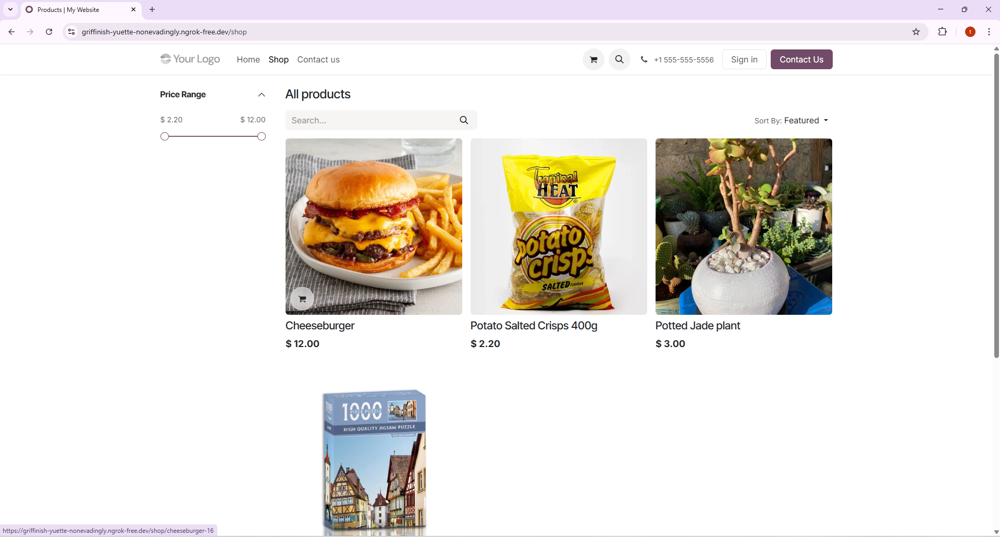
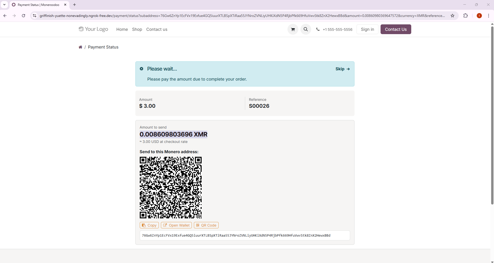
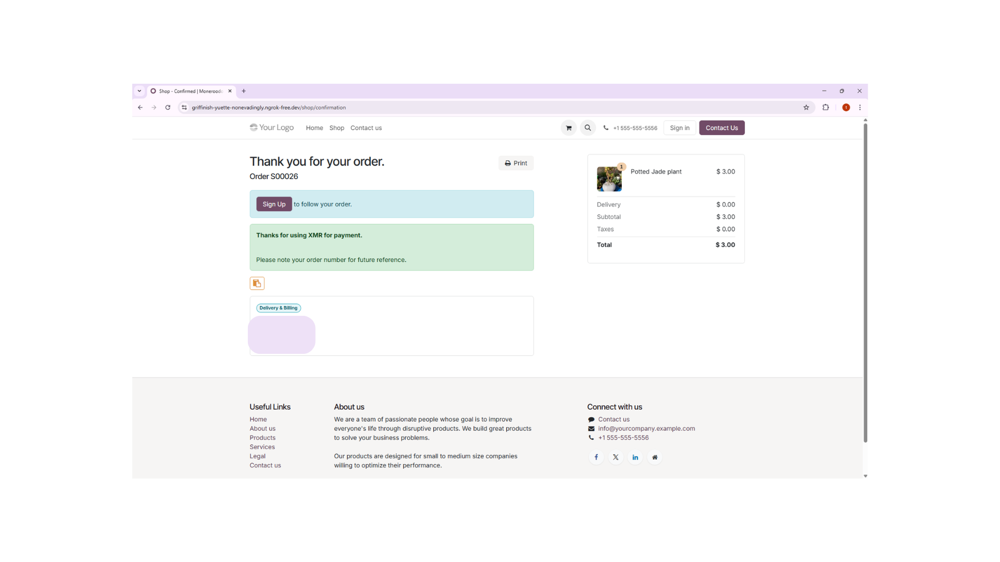

# monero-rpc-odoo

Accept Monero (XMR) payments in your Odoo 19 eCommerce shop via a self-hosted `monero-wallet-rpc`.

---

## Requirements

- Odoo 19.0
- Python 3.10+
- [`monero`](https://pypi.org/project/monero/) Python package (`pip install monero`)
- A synced `monerod` node
- A running `monero-wallet-rpc` instance (view-key wallet recommended)

---

## Installation

1. Copy the `monero-rpc-odoo` folder into your Odoo addons directory.
2. Restart Odoo.
3. Go to **Apps** → search for `monero_rpc_odoo` → **Install**.

---

## Configuration

### 1. Monero Wallet RPC

Start `monero-wallet-rpc` with a view-only wallet:

```bash
monero-wallet-rpc \
  --wallet-file /path/to/viewonly.wallet \
  --rpc-bind-port 18082 \
  --rpc-login user:password \
  --disable-rpc-login   # or keep login for security
```

See the [Monero Wallet RPC docs](https://www.getmonero.org/resources/developer-guides/wallet-rpc.html) for full options.

### 2. Odoo Payment Provider

1. Go to **Website → Configuration → Payment Providers**.
2. Find **Monero** and click **Configure**.
3. Fill in:
   - **RPC Host** — IP or hostname of your `monero-wallet-rpc` (default: `127.0.0.1`)
   - **RPC Port** — port (default: `18082`)
   - **RPC User / Password** — if authentication is enabled
   - **Security Level** — number of confirmations required (0 = instant, 10 = high security)
4. Set the provider to **Enabled**.

### 3. XMR Currency

1. Go to **Accounting → Configuration → Currencies**.
2. Find **XMR** and set it to **Active**.
3. The exchange rate is updated automatically every 15 minutes from CoinGecko.

---

## Usage

- Customers browsing your eCommerce shop can select **Monero** at checkout.
- They are shown a unique subaddress and QR code with the exact XMR amount to send.
- The payment is detected automatically. The page redirects to the order confirmation once payment is received.
- Products can be priced in USD (or any currency) — the XMR amount is calculated at checkout using the live rate.

---

## Security

- Each order gets a unique, one-time subaddress — no address reuse.
- Use a **view-only wallet** on the server so the RPC cannot spend funds.
- Set a higher confirmation level for large orders.

---


## 🌐 Live Demo
- We now have a *live demo environment* available;

  https://griffinish-yuette-nonevadingly.ngrok-free.dev

You can access the store, browse products, and test the full checkout flow.

 **Guest checkout is enabled** — no login or account required  

 ##






[Watch](https://youtu.be/4L7DzkyNuYI?si=tHmj3XkGnLrgoi3v)

---

## Important Notice

- This is a **demo / testing environment**
- It uses **Monero Stagenet (sXMR)** — NOT real XMR
- **Do NOT send real funds**
- Products are **not real** and orders are for testing only

## Getting sXMR (Test Funds)

To test checkout, you’ll need a small amount of **stagenet XMR (sXMR)**.

You can get free test coins from a faucet:

  https://cypherfaucet.com/xmr-stagenet

- Request a small amount (enough for testing payments)
- Use a **stagenet-enabled Monero wallet**
- Ensure your wallet is connected to a **stagenet node**


---

## Bug Tracker

Report issues on [GitHub Issues](https://github.com/monero-integrations/moneroodoo/issues).

---

## Credits

**Maintainer:** [Monero Integrations](https://github.com/monero-integrations)


